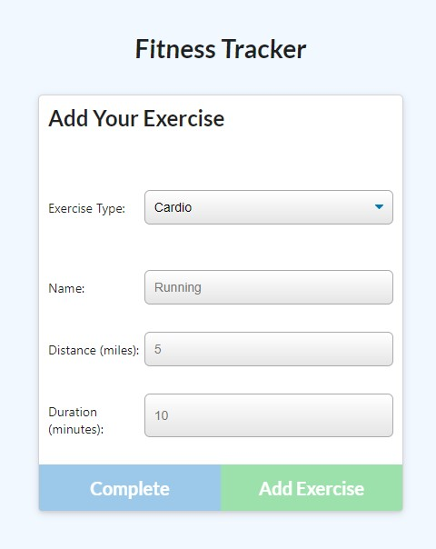
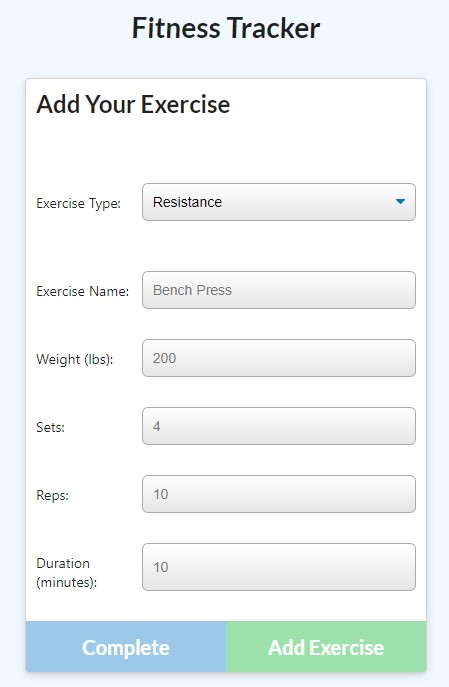
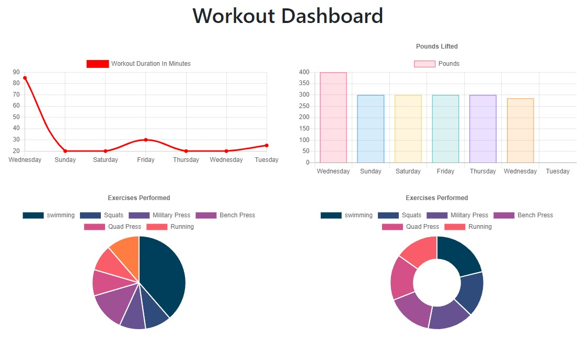

# Fitness Tracker

[](https://opensource.org/licenses/MIT)


## Description

A fitness tracker that allows to to track your workouts by entering them into the app which then stores them in a NoSQL database.


## Table of Contents
  
  * [Installation](#installation)
  * [Testing](#testing)
  * [Useage](#useage)
  * [Technologies](#technologies)
  * [License](#license)
  * [Contact](#contact)
  * [Links](#links)


## Installation

'git clone' from [my repository](https://github.com/TimMartin13/fitness-tracker) and then open the terminal window and navigate to the folder that holds the server.js file. Run

```
npm i
```
to install the all of the dependancies. The *nodemon* package is also convenient to install, just type

```
npm i --save-dev nodemon
```
into the terminal window.


## Testing

Vigorously, manually tested with various workouts.


## Useage
The easy way: click on the Heroku link in the Links section of this document, then click the New Workout button that looks like this:


You will be taken to the exercise page which looks like this:



Click on the arrow to the right of Exercise Type to choose resistance or cardio.  If you choose cardio, you will be presented with places to enter the name of the exercise, the distance, in miles, that you exercised for, and the duration of your exercise, in minutes.



If you would rather do a resistance workout, you will be presented with a place to store the exercise name, weight in lbs, the number of sets, the number of repetitions, and the duration of your workout.  Once all the information is entered, the blue and green button at the bottom with activate, allowing you to add another exercise to your workout or to complete the workout.

To see how your last 7 workouts have gone, click the Dashboard link in the upper left.  That will take you to the Workout Dashboard that looks similar to this:



The workout dashboard keeps track of the duration of all the workouts and the total weight lifted during your last 7 workouts.  It also keeps track of the cardio and resistance exercises that you have performed.

## Technologies

JavaScript, node.js, npm packages(express, nodemon, mongoose, morgan), HTML, CSS, MongoDB, Heroku, MVC model 


## License

Licensed under the [MIT](https://choosealicense.com/licenses/mit/) license 


## Contact

Email: timmartin13@gmail.com

Github: [TimMartin13](https://github.com/TimMartin13)


## Links

Deployed link: https://pacific-falls-39668.herokuapp.com/

Repository link: https://github.com/TimMartin13/fitness-tracker